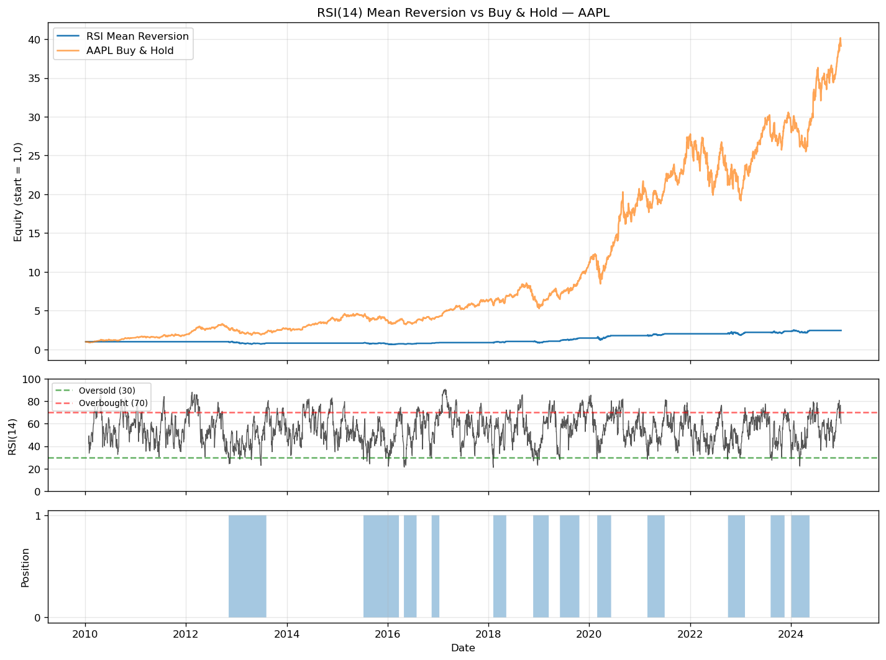

# Week 2 — RSI Mean Reversion

Testing whether the most famous oversold/overbought indicator actually identifies tradeable mean-reversion opportunities on individual stocks.

---

## Hypothesis

When the 14-day RSI drops below 30, short-term selling is exhausted and the price is likely to bounce. When RSI rises above 70, the move is overextended and a pullback is likely.

**Trading rule:** Enter long when RSI(14) crosses below 30. Exit when RSI(14) crosses above 70. Flat in between.

---

## Why this *should* work (in theory)

Mean reversion exists because markets overreact to short-term news. When a stock falls fast, forced sellers (margin calls, stop-losses, panicked retail) push price below where fundamentals justify. Once that selling exhausts, price drifts back toward the prior trend.

RSI captures the *velocity* of recent moves rather than their absolute level. A reading below 30 means recent down-days have dominated up-days by enough that, historically, a snap-back has tended to follow.

## Why it might fail

The strategy is **regime-dependent** — and it can fail in two distinct ways:

- **In a strong downtrend**, "oversold" just keeps getting more oversold. Buying RSI < 30 in a bear market means catching falling knives all the way down.
- **In a sustained uptrend**, oversold signals fire too rarely. The strategy sits flat for years while the asset rallies, and even a high win rate can't make up for the missed compounding.

Both failure modes are symptoms of the same underlying problem: mean reversion needs prices that actually mean-revert. In a strongly trending market — in either direction — they don't.

---

## Methodology

| Parameter | Value | Rationale |
|---|---|---|
| Asset | AAPL (primary), MSFT (robustness) | Liquid, individual stocks where mean reversion is more plausible than on indices |
| Period | 2010-01-01 → 2024-12-31 | ~15 years across multiple regimes (recovery, growth, COVID, rate hikes) |
| RSI period | 14 | Wilder's textbook default — no tuning |
| Thresholds | 30 / 70 | Wilder's textbook default — no tuning |
| Transaction cost | 5 bps per side | Realistic round-trip cost for a retail-level account |
| Benchmark | Buy & hold same ticker | Apples-to-apples |
| Look-ahead control | Signals shifted by 1 day | Today's RSI trades tomorrow's open |

---

## Results

| Metric | RSI Mean Reversion | Buy & Hold |
|---|---|---|
| Total return | **+145.0%** | +3,811.6% |
| Sharpe | 0.43 | 1.02 |
| Max drawdown | −37.7% | _(see note)_ |
| Trades | 12 | — |
| Win rate | 83.3% | — |
| Avg trade return | +8.6% | — |
| Time in market | 29.4% | 100% |

**Excess return vs benchmark: −3,667 percentage points.** The strategy was beaten on every dimension that mattered: lower total return, lower Sharpe, comparable drawdown, and 71% of the period spent uninvested while AAPL went up ~38x.



*Note: Buy & Hold max drawdown was not separately computed in this run — the metrics module currently reports drawdown only for the strategy equity. Adding a parallel B&H drawdown is a TODO for the shared metrics module.*

---

## What I learned

**The 83% win rate is the trap.** Looked at in isolation, "wins 83% of trades" sounds excellent. In context, it's the diagnostic signature of a mean-reversion strategy in the wrong regime. The strategy was almost always *right* when it traded — the problem was that it only traded 12 times in 15 years and sat flat the other 71% of the time. Being right doesn't matter if you don't have enough at-bats to compound.

**This is the win-rate-vs-expectancy lesson made concrete.** Average trade was +8.6% over an average holding period of weeks. That's a perfectly respectable per-trade edge. But with only ~1 trade per year and most of the capital sitting idle, the strategy generated ~6% annualised — while AAPL itself compounded at ~28% annualised. Expectancy is `(win rate × avg win) − (loss rate × avg loss) × frequency`. The strategy nailed the first three terms and got crushed on frequency.

**The dominant failure mode here was not what the original hypothesis predicted.** Going in, the obvious concern was "buying oversold in a downtrend" — catching falling knives. That's not what happened. AAPL 2010–2024 was one of the strongest sustained uptrends in market history; oversold signals were *rare*, and the strategy spent most of its life on the sidelines waiting for them. The failure was opportunity cost, not loss-taking. Mean reversion didn't lose money — it just made far less than holding the asset.

**Risk-adjusted comparison.** Even controlling for risk, B&H wins. Sharpe 0.43 vs 1.02 — the strategy's lower volatility doesn't compensate for its lower return. The max drawdown was comparable (−37.7%), so the "lower risk" narrative doesn't hold up either. There's no metric on which this implementation of RSI mean reversion beats simply holding AAPL.

**What would change my mind.** This single test can't condemn RSI mean reversion as an idea — it can only condemn this particular *application* of it. The next experiments worth running:

1. Run the same code on indices (SPY) where mean reversion theoretically should be weaker, and on choppy or mean-reverting names (utilities, REITs) where it should be stronger. If the result inverts, that's evidence the regime hypothesis is right.
2. Test the Connors RSI(2) variant — much shorter lookback, much more frequent signals. Higher frequency would directly address the "not enough at-bats" problem.
3. Add a trend filter: only take long signals when the 200-day MA is *not* rising. The strategy should only fire in regimes where it has a chance.

Items 1–3 are noted but deferred — running them here would amount to optimising on the same data the strategy was evaluated on.

---

## Limitations and honest caveats

- **Single-asset tests over-fit easily.** Results on AAPL may not generalise — robustness across a basket would be more credible.
- **Survivorship bias.** AAPL is one of the best-performing stocks of the period; the strategy may look better here than on a randomly-chosen ticker.
- **No regime filter.** A real implementation might gate the signal on a longer-term trend filter (e.g. only trade if 200-day MA is rising).
- **Threshold optimisation was deliberately skipped.** Tuning 30/70 on the same data the strategy is evaluated on would be look-ahead by another name.
- **Slippage and market impact aren't modelled** — 5 bps is a reasonable proxy but real costs vary by stock and time of day.

---

## How to run

```bash
cd week-02-rsi-reversion
python strategy.py --ticker AAPL --start 2010-01-01 --end 2024-12-31
```

Other tickers to test:
```bash
python strategy.py --ticker MSFT
python strategy.py --ticker SPY        # for the index comparison
python strategy.py --ticker XOM        # different sector
```

Outputs land in this folder: `backtest.csv`, `metrics.csv`, `equity_curve.png`.

---

## Reference

Connors, L. & Alvarez, C. (2009). *Short-Term Trading Strategies That Work*. TradingMarkets Publishing.