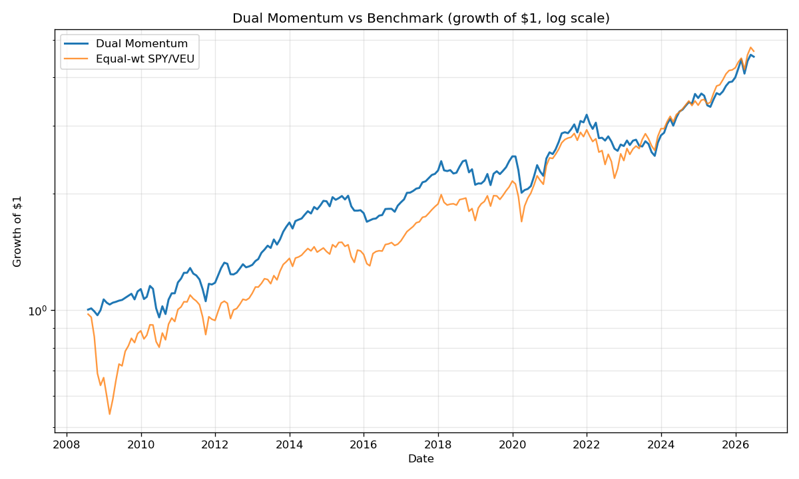

# Week 4 — Dual Momentum (cross-asset)

The fourth strategy in a 10-week series of quantitative trading backtests,
implemented from scratch in Python with an honest write-up of what worked
and — more usefully — what didn't.

---

## The idea

Dual momentum combines two signals, applied monthly:

1. **Relative momentum** — among the risky assets (SPY, VEU), hold whichever
   has the higher trailing 12-month return.
2. **Absolute momentum** — but only if that winner's 12-month return also
   beats cash (BIL). If it doesn't, step aside into bonds (AGG).

So the strategy is always in one of three states: the strongest equity sleeve,
the other equity sleeve, or bonds. Signals are formed at month-end and applied
to the *following* month — no lookahead.

**Reference:** Antonacci (2012), *Risk Premia Harvesting Through Dual Momentum*.

---

## Hypothesis

Combining relative momentum (pick the strongest equity) with absolute momentum
(get out when nothing is working) should deliver roughly equity-like returns
with materially smaller drawdowns — the classic "participate in the upside,
dodge the worst of the downside" claim.

---

## Setup

| Parameter        | Value                                   |
|------------------|-----------------------------------------|
| Risky sleeve     | SPY (US equity), VEU (ex-US equity)     |
| Bond / defensive | AGG                                     |
| Cash proxy       | BIL                                     |
| Lookback         | 12 months                               |
| Rebalance        | Monthly                                 |
| Transaction cost | 10 bps, one-way, charged only on switch |
| Benchmark        | Equal-weight SPY/VEU, monthly rebalanced|
| Period           | Jul 2008 – Jun 2026 (216 months)        |
| Data             | yfinance, dividend-adjusted             |

---

## Results



|                  | Dual Momentum | Equal-wt SPY/VEU |
|------------------|---------------|------------------|
| Total return     | 351.96%       | 366.99%          |
| CAGR             | 8.74%         | 8.94%            |
| Ann. volatility  | 12.84%        | 16.24%           |
| **Sharpe**       | **0.72**      | 0.61             |
| **Max drawdown** | **−21.69%**   | −44.82%          |

**Holding breakdown:** SPY 65.7% · VEU 18.1% · AGG (bonds) 16.2% · 31 switches.

---

## What I found

**The win was risk-adjusted, not raw.** The strategy slightly *underperformed*
the benchmark on total return but did so with far less volatility and roughly
half the maximum drawdown, lifting the Sharpe from 0.61 to 0.72. This is the
textbook dual-momentum signature: you trade a little upside for a lot of
downside protection.

**The protection is concentrated in one place — the Global Financial Crisis.** The strategy opened
in bonds in mid-2008 and held them through the crash. In October 2008 the
benchmark fell about 19.6% in a single month while the strategy lost only 2.3%.
Most of the −44.82% vs −21.69% drawdown gap was earned right there.

**Relative momentum added almost nothing here; absolute momentum did the work.**
The strategy spent 65.7% of its life in SPY — the stronger of the two equities
over this period — yet still couldn't beat a naive equal-weight basket on
return. With 31 switches, the timing lag and transaction costs of rotating
between SPY and VEU roughly cancelled out the benefit of picking the winner.
What genuinely helped was the *absolute* gate: getting out of equities
entirely when momentum turned negative.

---

## Caveats / what I'd do differently

- **The sample window flatters the strategy.** Starting in mid-2008 means the
  test opens with the GFC — exactly the environment where a defensive strategy
  looks heroic. A start date in, say, 2013 would tell a less flattering story.
  The drawdown comparison should be read with that in mind.
- **Thin relative-momentum menu.** With only two risky assets, the
  relative-momentum leg has little to choose between. Adding more (EEM, sector
  or factor ETFs) would give it more to work with — at the cost of more
  turnover. (`python strategy.py --risky SPY VEU EEM`.)
- **Single lookback, deliberately not tuned.** I used 12 months and did not
  sweep 6/9/12-month variants. Consistent with the rest of the series, I'm
  avoiding parameter optimization on the same data the result is reported on —
  that's how you fool yourself into "discovering" alpha.
- **Flat transaction costs.** Real costs vary by asset and size; 10 bps is a
  reasonable round number, not a measured one.
- **Benchmark choice matters.** Against an equal-weight SPY/VEU basket the
  return is a near-tie; against buy-and-hold SPY alone it would lag more on
  return (SPY beat VEU significantly this period) but still cut drawdown sharply.

---

## Run it yourself

```bash
pip install yfinance pandas numpy matplotlib

python strategy.py                        # SPY vs VEU, equal-weight benchmark
python strategy.py --risky SPY VEU EEM    # add emerging markets
python strategy.py --benchmark SPY        # measure against plain SPY
python strategy.py --lookback 6           # shorter momentum window
```

Outputs (`backtest.csv`, `metrics.csv`, `equity_curve.png`) are written next
to the script.

---

## Files

| File              | Description                                  |
|-------------------|----------------------------------------------|
| `strategy.py`     | Full backtest — data, signals, metrics, plot |
| `backtest.csv`    | Monthly holdings and returns                 |
| `metrics.csv`     | Summary statistics                           |
| `equity_curve.png`| Growth of $1, strategy vs benchmark          |

---

*Part of a 10-week quant strategy series.*
