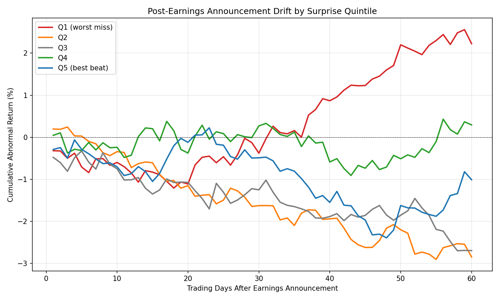

# Week 5 — Post-Earnings Announcement Drift (PEAD)

Event-driven backtest of the classic earnings-drift anomaly on 15 US mega-caps (2018–2024). Part of the [10-week quant strategy series](../).

## Result

**Null / no exploitable drift.** The long-Q5 strategy (buy biggest earnings beats, hold 20 days) returned **–0.22% abnormal per trade** vs. an equal-weight benchmark, beat the market only **41%** of the time, and was worse risk-adjusted (**Sharpe 0.85 vs 1.46**). The textbook monotonic drift didn't appear; past ~40 days the ranking inverted (worst-miss stocks rebounded).

| Metric | Strategy | Benchmark |
|---|---:|---:|
| Avg return / trade (net) | +2.18% | +2.41% |
| Avg abnormal return | −0.22% | — |
| Hit rate vs. market | 41.2% | — |
| Ann. return (approx) | 27.5% | 30.3% |
| Ann. vol (approx) | 32.3% | 20.8% |
| Sharpe (approx) | 0.85 | 1.46 |

*n = 51 Q5 events, 20-day hold, 10 bps round-trip.*



## Hypothesis

Investors underreact to earnings surprises, so stocks that beat estimates keep drifting up for weeks (Ball & Brown 1968; Bernard & Thomas 1989). Test: sort events into surprise quintiles, go long the top quintile for ~1 month, measure abnormal return vs. the market.

## Method

- **Surprise (SUE):** `(EPS_actual − EPS_estimate) / |EPS_estimate|`, bucketed into quintiles (Q1 = worst miss, Q5 = best beat).
- **Entry:** next trading day's close after the announcement — no look-ahead.
- **Hold:** 20 trading days; drift tracked to 60.
- **Abnormal return:** stock return minus equal-weight universe return over the same window.
- **Cost:** 10 bps round-trip (Week 4+ convention; Weeks 1–3 used 5 bps).
- **Benchmark:** equal-weight universe over identical event windows.
- **Data:** `yfinance` prices + `earnings_dates`. 252 events with complete EPS data.

## Run

```bash
pip install yfinance pandas numpy matplotlib
python strategy.py

python strategy.py --hold 40                    # longer window
python strategy.py --cost-bps 5                  # match Weeks 1–3
python strategy.py --start 2010-01-01 --end 2019-12-31   # pre-COVID
```

## Files

| File | Description |
|---|---|
| `strategy.py` | Backtest: earnings fetch → SUE quintiles → event study → long-Q5 |
| `earnings_events.csv` | All events: surprise, SUE, quintile, holding return |
| `quintile_returns.csv` | Avg cumulative abnormal return by quintile × horizon |
| `q5_trades.csv` | Per-trade detail for the long-Q5 strategy |
| `metrics.csv` | Strategy vs. benchmark summary |
| `drift_curve.png` | CAR by surprise quintile over 60 days |
| `quintile_bar.png` | Abnormal return by quintile at day 20 |

## Notes & limitations

- **Universe bias.** 15 mega-caps are the most efficiently priced stocks — where PEAD is expected to be weakest. Classic PEAD is strongest in small/mid-caps.
- **Regime.** 2018–2024 is COVID-distorted; some Q5 surprises (e.g. AMZN SUE 5.5–6.3) are pandemic accounting artifacts. The day 40–60 Q1 rebound is likely regime-driven reversal, not drift.
- **Data.** `yfinance` earnings coverage is patchy; MSFT failed to download this run and was dropped.
- **Long-only.** No Q5−Q1 spread tested (the tail reversal suggests shorting Q1 would have hurt).

## References

- Ball & Brown (1968), *An Empirical Evaluation of Accounting Income Numbers.*
- Bernard & Thomas (1989), *Post-Earnings-Announcement Drift.*
