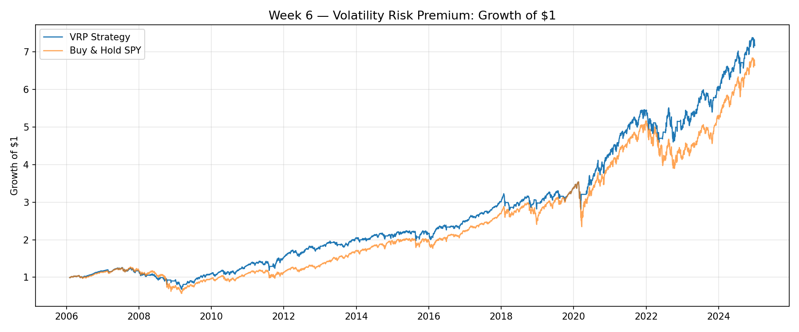
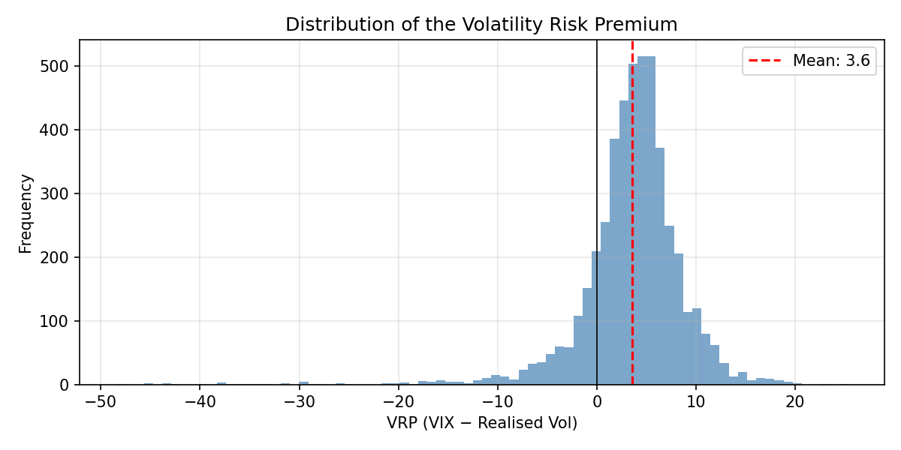
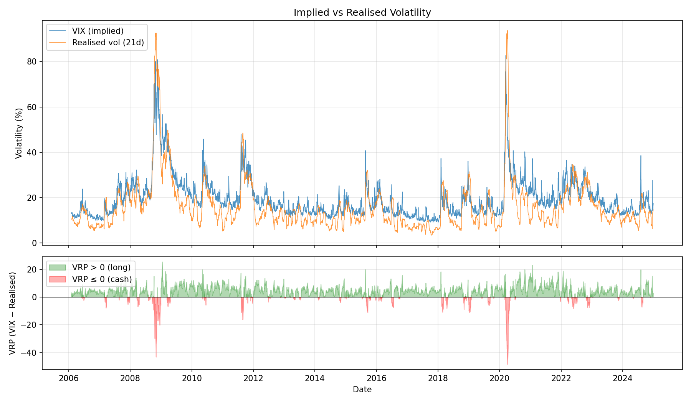
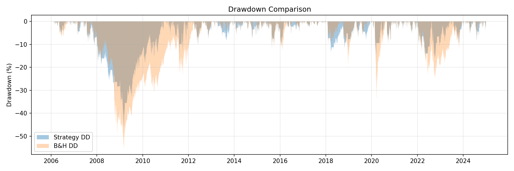

# Week 6 — Volatility Risk Premium (VRP)

**Result: Won on risk-adjusted terms. Tail risk still intact.**

| Metric | VRP Strategy | Buy & Hold SPY |
|---|---|---|
| Total return | +616.20% | +563.68% |
| CAGR | 10.99% | 10.54% |
| Ann. volatility | 16.09% | 19.42% |
| Sharpe | 0.683 | 0.543 |
| Max drawdown | −45.92% | −55.19% |
| Calmar | 0.239 | 0.191 |
| Time in market | 84.5% | 100% |
| Switches | 261 | — |



---

## Hypothesis

Implied volatility (VIX) is systematically higher than subsequent realised volatility. Investors overpay for downside protection — they're buying insurance — and the seller of that insurance earns a persistent premium. A strategy that harvests this gap should earn a steady return, punctuated by severe drawdowns when realised vol spikes past implied.

**Reference:** Carr & Wu (2009), *Variance Risk Premiums*, Review of Financial Studies.

---

## Method

- **Implied vol:** VIX (CBOE 30-day implied vol on SPX options).
- **Realised vol:** 21-trading-day rolling standard deviation of SPY daily log returns, annualised (×√252), scaled to percentage points to match VIX.
- **Signal:** VRP = VIX − realised vol. When VRP > 0, go long SPY; when VRP ≤ 0, step to cash.
- **Entry:** signal computed at close, position applied next day (one-day lag).
- **Cost:** 10 bps per switch (Week 4+ convention).
- **Benchmark:** buy-and-hold SPY over the same period.
- **Period:** 2006-01-01 to 2024-12-31 (~19 years, 4,758 trading days).

**Important:** this is a *proxy* backtest. We're not selling options or variance swaps — we're using SPY exposure as a stand-in for the return you'd earn by being in the market when the vol premium is positive. Real vol-selling strategies have different P&L profiles, leverage, and margin requirements.

---

## The premium is real

| VRP Stat | Value |
|---|---|
| Mean | 3.55 |
| Median | 3.99 |
| Std dev | 5.39 |
| % positive | 84.5% |
| 5th percentile | −4.43 |
| 95th percentile | 10.62 |
| Min | −48.43 |
| Max | 25.27 |

VIX overstates future realised vol 84.5% of the time, by an average of 3.55 percentage points. The distribution is right-skewed in normal markets — the premium is positive and steady — with a vicious left tail when crashes send realised vol past implied.





---

## What the strategy did

The VRP signal splits the sample into "premium exists" (84.5% of days) and "premium has inverted" (15.5%). By stepping aside during inversions, the strategy:

- **Cut volatility** from 19.42% to 16.09% (−17%).
- **Cut max drawdown** from −55.19% to −45.92% (−9.3 pp).
- **Lifted Sharpe** from 0.543 to 0.683 (+26%).
- **Added 45 bps of CAGR** (10.99% vs 10.54%).

The raw return edge is small. The risk-adjusted improvement is where the strategy earns its keep — same pattern as Week 4 (dual momentum), where the absolute gate did the heavy lifting.

### Year-by-year

| Year | Strategy | Benchmark | Excess | Time long | Avg VRP |
|---|---|---|---|---|---|
| 2006 | +16.52% | +13.66% | +2.85 | 93.4% | 3.19 |
| 2007 | +0.03% | +5.15% | −5.12 | 82.9% | 2.86 |
| 2008 | −22.49% | −36.80% | +14.31 | 58.9% | −1.17 |
| 2009 | +20.28% | +26.35% | −6.07 | 90.1% | 6.21 |
| 2010 | +20.89% | +15.06% | +5.84 | 94.0% | 5.75 |
| 2011 | +15.65% | +1.89% | +13.76 | 83.7% | 3.95 |
| 2012 | +17.17% | +15.99% | +1.18 | 93.2% | 5.16 |
| 2013 | +15.43% | +32.31% | −16.88 | 80.6% | 3.21 |
| 2014 | +3.14% | +13.46% | −10.33 | 86.1% | 3.75 |
| 2015 | +2.42% | +1.23% | +1.18 | 81.3% | 2.12 |
| 2016 | +13.68% | +12.00% | +1.69 | 81.0% | 3.43 |
| 2017 | +21.71% | +21.71% | 0.00 | 100.0% | 4.37 |
| 2018 | −0.91% | −4.57% | +3.66 | 73.3% | 2.32 |
| 2019 | +13.16% | +31.22% | −18.07 | 79.0% | 2.70 |
| 2020 | +28.14% | +18.33% | +9.80 | 81.8% | 3.03 |
| 2021 | +25.56% | +28.73% | −3.17 | 97.6% | 7.25 |
| 2022 | −7.32% | −18.18% | +10.85 | 66.1% | 1.90 |
| 2023 | +20.76% | +26.18% | −5.42 | 93.2% | 3.75 |
| 2024 | +18.12% | +25.34% | −7.22 | 90.4% | 3.68 |

The pattern: the strategy earns its keep in bad years (2008, 2011, 2018, 2020, 2022) and gives back ground in clean rallies (2013, 2014, 2019). In 2017 — a year of historically low volatility — the signal never triggered a single exit (VRP was positive all year, avg 4.37), so the strategy matched buy-and-hold exactly with zero switches.

### Worst drawdowns

| Start | Trough | End | Depth | Length (days) |
|---|---|---|---|---|
| 2007-07-20 | 2009-03-09 | 2010-11-04 | −45.92% | 1,203 |
| 2020-02-20 | 2020-03-12 | 2020-06-03 | −20.59% | 104 |
| 2011-05-02 | 2011-08-08 | 2011-10-21 | −17.31% | 172 |
| 2022-08-17 | 2022-09-30 | 2023-06-02 | −16.54% | 289 |
| 2021-12-13 | 2022-05-12 | 2022-08-12 | −15.86% | 242 |

The GFC drawdown is still −45.92%. The signal stepped to cash for part of the decline (only 58.9% time-in-market in 2008) but didn't get out early enough — realised vol lags the crash by definition. The signal caught the *middle* of the drawdown, not the start.

COVID was the better showcase: −20.59% vs buy-and-hold's −33.7%, because the vol spike was faster and the signal turned more quickly.



---

## What this means

The volatility risk premium is real — implied vol overstates future realised vol the large majority of the time — and a strategy that harvests it earns a better risk-adjusted return than buy-and-hold. But two things undercut the naive story:

1. **The signal is backward-looking.** Realised vol is computed from *past* returns. By the time it spikes past VIX, the crash has already started. The signal tells you to leave the party after the fight has broken out. That's why the GFC drawdown was still −45.92% — deeper than a 10% threshold gate would have allowed.

2. **The premium is compensation for risk, not free money.** The left tail of the VRP distribution (min: −48.43) is where all the danger lives. The average seller collects 3.5 points of premium 85% of the time and gives back years of gains in a single month. This is the "picking up pennies in front of a steamroller" structure that makes short-vol strategies famous and infamous.

The proxy-backtest caveat matters here more than in previous weeks. A real vol-selling strategy (short straddles, short VIX futures, selling variance swaps) would have a different — and likely worse — tail profile than what this SPY-long-or-cash proxy shows. The actual "selling insurance" trade involves leverage, margin calls, and convexity that this backtest doesn't capture.

---

## Notes & limitations

- **Proxy, not reality.** This tests "be in the market when VRP is positive," not actual option selling. The P&L of selling straddles or VIX futures would differ substantially, especially in the tails.
- **Single lookback window.** 21-day realised vol only. A 10-day or 63-day window would change the signal timing. Consistent with the series, I used the textbook default and did not sweep.
- **Threshold = 0.** The strategy enters whenever VRP is any amount above zero. A 2- or 3-point threshold would filter out low-conviction signals at the cost of less time in market.
- **Cash earns nothing.** The risk-free rate is set to 0. In practice, cash periods would earn T-bill rates — a small tailwind for the strategy.
- **Start date includes the GFC.** Starting in 2006 means the test opens with a crisis — same caveat as Week 4. A 2010-start backtest would show a smaller DD improvement.
- **No leverage, no margin.** Real short-vol strategies use leverage; this doesn't. The Sharpe and drawdown comparison is directionally correct but not magnitudinally representative of actual vol-selling.

---

## Run

```bash
pip install yfinance pandas numpy matplotlib
python strategy.py

python strategy.py --lookback 10            # 10-day realised vol
python strategy.py --threshold 2            # require 2-point VRP cushion
python strategy.py --cost-bps 5             # match Weeks 1–3
python strategy.py --start 2010-01-01 --end 2023-12-31  # post-GFC window
```

## Files

| File | Description |
|---|---|
| `strategy.py` | Full backtest: VIX/SPY data, VRP signal, long-or-cash strategy |
| `backtest.csv` | Daily positions, returns, and cumulative equity |
| `metrics.csv` | Strategy vs. benchmark summary |
| `annual_returns.csv` | Year-by-year breakdown |
| `worst_drawdowns.csv` | 5 deepest drawdown periods |
| `vrp_summary.csv` | VRP distribution statistics |
| `equity_curve.png` | Growth of $1 |
| `vrp_diagnostic.png` | Implied vs realised vol + VRP signal |
| `drawdown.png` | Drawdown comparison |
| `vrp_distribution.png` | VRP histogram |

## References

- Carr, P. & Wu, L. (2009). *Variance Risk Premiums.* Review of Financial Studies, 22(3), 1311–1341.
- Ilmanen, A. (2011). *Expected Returns*, Ch. 9: Volatility selling.

---

### Series progress

| # | Strategy | Asset(s) | Result |
|---|---|---|---|
| 01 | Moving Average Crossover (10/50) | SPY | Lost vs B&H |
| 02 | RSI Mean Reversion | AAPL | High win rate, lost vs B&H |
| 03 | Day-of-Week (Calendar) Effect | 5 tickers | Null; lost B&H |
| 04 | Dual Momentum (cross-asset) | SPY, VEU | Won risk-adj. |
| 05 | Post-Earnings Announcement Drift | 15 mega-caps | Null / reversal; lost benchmark |
| 06 | Volatility Risk Premium | SPY, VIX | Won risk-adj.; tail risk intact |

*"Result" reports honest outcomes vs. a sensible benchmark — not whether I'd trade it.*
